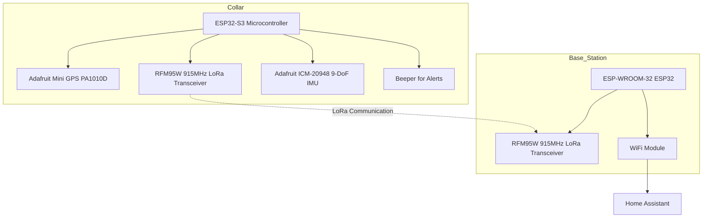

# Uncollar Agent Instructions

An open-source GPS-tracking dog collar project designed for pet owners who want to monitor their dog's location, set boundaries, and receive alerts via a LoRa-connected base station integrated with Home Assistant.

## Project Overview

Uncollar aims to provide a fully hackable, low-power GPS tracking solution for dogs. The system consists of a collar equipped with GPS, LoRa radio, and optional sensors, communicating with a base station that interfaces with Home Assistant for seamless user interaction. The project reuses the housing from an electric fence dog collar and incorporates commercial off-the-shelf (COTS) electronics to keep costs low and customization high.

### Key Objectives

- Open-source and modifiable design
- Accurate GPS location tracking
- Configurable boundary alerts (beep/vibration/shock for the dog, notifications for the owner)
- Long-range communication via LoRa radio
- Home Assistant integration for remote monitoring and control
- Rechargeable, low-power operation

### Features

- **GPS Tracking**: Real-time location monitoring using GPS modules.
- **Boundary Alerts**: Define virtual fences; alerts triggered when the dog crosses boundaries.
- **LoRa Communication**: Reliable, long-range wireless communication between collar and base station.
- **Home Assistant Integration**: Seamless UI for monitoring and configuration via MQTT.
- **Low Power Design**: Optimized for battery life with rechargeable components.
- **Open Source**: Fully hackable hardware and software under Apache 2.0 license.
- **Optional Sensors**: IMU for activity detection and orientation.

## Project Structure

```
uncollar/
├── src/                    # Source code - main.cpp entrypoint
│   └── main.cpp           # Main firmware entry point
├── lib/                    # Reusable libraries (create subdirectories)
├── tests/                  # Unit tests for library components
├── docs/                   # Documentation files
├── hardware/
│   └── documentation/     # Hardware documentation
├── platformio.ini         # PlatformIO configuration
└── AGENTS.md              # This file
```

### Directory Rules

| Directory | Purpose | When to Use |
|-----------|---------|-------------|
| `src/` | Main application code | For `main.cpp` or app-specific code |
| `lib/` | Reusable libraries | When creating components used across multiple files |
| `tests/` | Unit tests | When testing library components |
| `docs/` | Documentation | When adding project documentation |
| `hardware/documentation/` | Hardware docs | When documenting hardware decisions |

**Rule**: Always prefer creating reusable libraries in `lib/` over putting all code in `main.cpp`.

## Code Style Guidelines

### Language and Framework

- **Language**: C++ (Arduino framework)
- **Platform**: ESP32 (PlatformIO)
- **Libraries**: Arduino libraries and conventions

### Coding Rules

1. **File organization**:
   - Entry point: `src/main.cpp`
   - Libraries: `lib/<library_name>/`
   - Tests: `tests/<test_name>.cpp`

2. **Naming conventions**:
   - Classes: `CamelCase` (e.g., `GpsManager`)
   - Functions: `camelCase` (e.g., `getLocation()`)
   - Constants: `SCREAMING_SNAKE_CASE` (e.g., `MAX_RETRIES`)
   - Files: `snake_case` (e.g., `gps_manager.cpp`)

3. **Code structure**:
   - Use header guards in `.h` files
   - Keep functions focused and single-purpose
   - Add comments for complex logic
   - Use meaningful variable names

4. **Error handling**:
   - Return error codes or use exceptions appropriately
   - Log errors with meaningful messages
   - Handle edge cases explicitly

### Documentation

- Write documentation in Markdown
- Use mkdocs for publishing to GitHub pages
- Document public APIs with parameters and return values

## Hardware

The project uses COTS components for ease of assembly and modification.

### Collar Components

- **Microcontroller**: Adafruit QT Py ESP32-S3 WiFi Dev Board
- **GPS Module**: Adafruit Mini GPS PA1010D (with antenna)
- **LoRa Radio**: RFM95W 915MHz transceiver
- **IMU (Optional)**: Adafruit TDK InvenSense ICM-20948 9-DoF IMU
- **Antenna**: Custom pigtail antenna
- **Alert Mechanism**: Beeper (for audible alerts)
- **Power**: Rechargeable battery (via Adafruit LiIon or LiPoly Charger BFF)

### Base Station Components

- **Microcontroller**: ESP-WROOM-32 ESP32S Development Board (with WiFi)
- **LoRa Radio**: RFM95W 915MHz transceiver
- **Antenna**: Custom pigtail antenna

For a complete hardware inventory, see [hardware/documentation/inventory.md](hardware/documentation/inventory.md).

### System Diagram



## Testing

### Test Organization

- Create unit tests for library components in `tests/`
- Each test file should focus on a single library or component
- Use descriptive test names that explain what is being tested

### Running Tests

```bash
pio test
```

### Test Conventions

- Include `#include <unity.h>` or similar test framework
- Use `TEST_ASSERT_*` macros for assertions
- Document expected behavior in comments

---

## Build and Run Instructions

### Build Firmware

```bash
pio run
```

### Upload to Device

```bash
pio run --target upload
```

### Monitor Serial Output

```bash
pio device monitor
```

### Clean Build

```bash
pio run --target clean
```

---

## Safety and Restrictions

### What NOT To Do

1. **Do not modify**: License files, unless explicitly requested
2. **Do not delete**: Existing tests without confirming with user
3. **Do not commit**: Changes without review (use Review mode first)
4. **Do not assume**: Always ask clarifying questions when uncertain

### Best Practices

1. **Backup before major changes**: Use the user's version control
2. **Test incrementally**: Verify changes work before moving on
3. **Document unknowns**: Note areas needing investigation
4. **Ask for help**: Use Ask mode or ask_followup_question when stuck

---

## License

This project is licensed under Apache 2.0. See [LICENSE](LICENSE) file for details.
