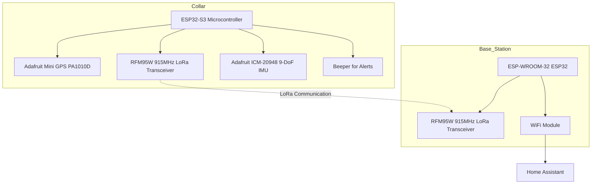
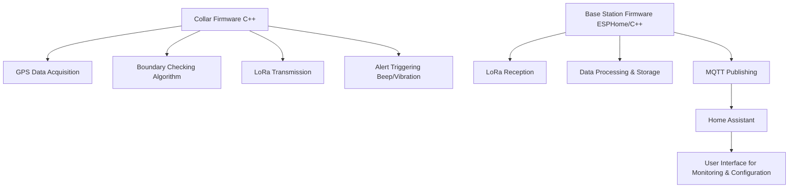

# Uncollar

An open-source GPS-tracking dog collar project designed for pet owners who want to monitor their dog's location, set boundaries, and receive alerts via a LoRa-connected base station integrated with Home Assistant.

## Description

Uncollar aims to provide a fully hackable, low-power GPS tracking solution for dogs. The system consists of a collar equipped with GPS, LoRa radio, and optional sensors, communicating with a base station that interfaces with Home Assistant for seamless user interaction. The project reuses the housing from an electric fence dog collar and incorporates commercial off-the-shelf (COTS) electronics to keep costs low and customization high.

Key objectives:
- Open-source and modifiable design
- Accurate GPS location tracking
- Configurable boundary alerts (beep/vibration/shock for the dog, notifications for the owner)
- Long-range communication via LoRa radio
- Home Assistant integration for remote monitoring and control
- Rechargeable, low-power operation

## Features

- **GPS Tracking**: Real-time location monitoring using GPS modules.
- **Boundary Alerts**: Define virtual fences; alerts triggered when the dog crosses boundaries.
- **LoRa Communication**: Reliable, long-range wireless communication between collar and base station.
- **Home Assistant Integration**: Seamless UI for monitoring and configuration via MQTT.
- **Low Power Design**: Optimized for battery life with rechargeable components.
- **Open Source**: Fully hackable hardware and software under Apache 2.0 license.
- **Optional Sensors**: IMU for activity detection and orientation.

## Hardware

The project uses COTS components for ease of assembly and modification.

### Collar Components

- **Microcontroller**: Adafruit QT Py ESP32-S3 WiFi Dev Board
- **GPS Module**: Adafruit Mini GPS PA1010D (with antenna)
- **LoRa Radio**: RFM95W 915MHz transceiver
- **IMU (Optional)**: Adafruit TDK InvenSense ICM-20948 9-DoF IMU
- **Antenna**: Custom pigtail antenna
- **Alert Mechanism**: Beeper (for audible alerts)
- **Power**: Rechargeable battery (via Adafruit LiIon or LiPoly Charger BFF)

### Base Station Components

- **Microcontroller**: ESP-WROOM-32 ESP32S Development Board (with WiFi)
- **LoRa Radio**: RFM95W 915MHz transceiver
- **Antenna**: Custom pigtail antenna

For a complete hardware inventory, see [hardware/documentation/inventory.md](hardware/documentation/inventory.md).

### System Diagram



## Software

The software is designed to run on ESP32-based microcontrollers.

- **Collar Firmware**: Handles GPS data acquisition, boundary checking, LoRa transmission, and alert triggering. Written in C++ for efficiency.
- **Base Station Firmware**: Receives LoRa data, processes it, and communicates with Home Assistant via MQTT. Preferably implemented using ESPHome for ease of configuration; falls back to raw C++ if ESPHome lacks required LoRa flexibility.
- **Home Assistant Integration**: Uses MQTT for real-time data exchange, allowing users to view location, set boundaries, and receive alerts through the Home Assistant dashboard.

### Software Architecture Diagram



## Installation (Nominal - To Be Completed)

### Prerequisites
- ESP32 development environment (Arduino IDE or ESP-IDF)
- Home Assistant instance
- MQTT broker (e.g., Mosquitto)

### Collar Setup
1. Assemble hardware components as per schematics.
2. Flash collar firmware to ESP32-S3.
3. Configure GPS and LoRa settings.
4. Test boundary alerts.

### Base Station Setup
1. Assemble base station hardware.
2. Install ESPHome or flash custom C++ firmware.
3. Configure LoRa and MQTT connections.
4. Integrate with Home Assistant via MQTT discovery.

Detailed setup instructions will be added as development progresses.

## Usage (Nominal - To Be Completed)

1. Power on the collar and base station.
2. Use Home Assistant to define boundaries and monitor the dog's location.
3. Receive alerts on your device when the dog approaches or crosses boundaries.
4. Recharge the collar as needed.

Example Home Assistant configuration snippet:
```yaml
mqtt:
  sensor:
    - name: "Dog Location"
      state_topic: "uncollar/location"
      value_template: "{{ value_json.latitude }}, {{ value_json.longitude }}"
```

## Contributing (Nominal - To Be Completed)

Contributions are welcome! This project is open-source under the Apache 2.0 license.

- Fork the repository
- Create a feature branch
- Submit a pull request with detailed changes

For hardware contributions, please document any modifications in the inventory or schematics.

## License

This project is licensed under the Apache License 2.0. See [LICENSE](LICENSE) for details.
