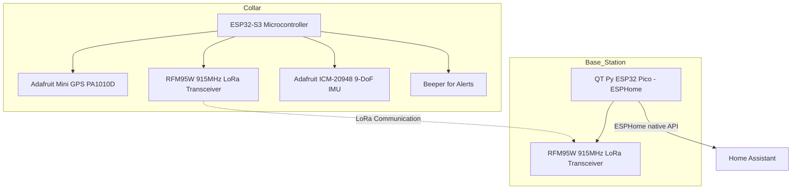
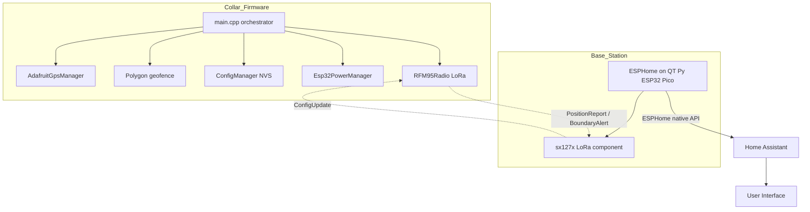

# Uncollar

An open-source GPS-tracking dog collar project designed for pet owners who want to monitor their dog's location, set boundaries, and receive alerts via a LoRa-connected base station integrated with Home Assistant.

## Repository Structure

This is a monorepo. Each system component has its own top-level directory:

| Directory | Contents | Status |
|---|---|---|
| [`collar/`](collar/) | ESP32-S3 collar firmware — GPS, geofence, LoRa TX, deep sleep | Active |
| [`basestation/`](basestation/) | ESP32 base station firmware — LoRa RX, WiFi, Home Assistant via ESPHome | Active |
| [`homeassistant/`](homeassistant/) | Home Assistant custom integration — device tracker, alerts, config UI | Planned |
| [`hardware/`](hardware/) | Bill of materials and component documentation | Active |
| [`docs/`](docs/) | Project-wide documentation (MkDocs) | Active |

## Description

Uncollar aims to provide a fully hackable, low-power GPS tracking solution for dogs. The system consists of a collar equipped with GPS, LoRa radio, and optional sensors, communicating with a base station that interfaces with Home Assistant for seamless user interaction. The project reuses the housing from an electric fence dog collar and incorporates commercial off-the-shelf (COTS) electronics to keep costs low and customization high.

Key objectives:
- Open-source and modifiable design
- Accurate GPS location tracking
- Configurable boundary alerts (beep/vibration/shock for the dog, notifications for the owner)
- Long-range communication via LoRa radio
- Home Assistant integration for remote monitoring and control
- Rechargeable, low-power operation

## Features

- **GPS Tracking**: Real-time location monitoring using GPS modules.
- **Boundary Alerts**: Define virtual fences; alerts triggered when the dog crosses boundaries.
- **LoRa Communication**: Reliable, long-range wireless communication between collar and base station.
- **Home Assistant Integration**: Seamless UI for monitoring and configuration via ESPHome native API.
- **Low Power Design**: Optimized for battery life with rechargeable components.
- **Open Source**: Fully hackable hardware and software under Apache 2.0 license.
- **Optional Sensors**: IMU for activity detection and orientation.

## Hardware

The project uses COTS components for ease of assembly and modification.

### Collar Components

- **Microcontroller**: Adafruit QT Py ESP32-S3 WiFi Dev Board
- **GPS Module**: Adafruit Mini GPS PA1010D (with antenna)
- **LoRa Radio**: RFM95W 915MHz transceiver
- **IMU (Optional)**: Adafruit TDK InvenSense ICM-20948 9-DoF IMU
- **Antenna**: Custom pigtail antenna
- **Alert Mechanism**: Beeper (for audible alerts)
- **Power**: Rechargeable battery (via Adafruit LiIon or LiPoly Charger BFF)

### Base Station Components

- **Microcontroller**: Adafruit QT Py ESP32 Pico
- **LoRa Radio**: RFM95W 915MHz transceiver
- **Antenna**: Custom pigtail antenna

For a complete hardware inventory, see [hardware/documentation/inventory.md](hardware/documentation/inventory.md).

### System Diagram


```mermaid
graph TD
    subgraph Collar
        A[ESP32-S3 Microcontroller]
        B[Adafruit Mini GPS PA1010D]
        C[RFM95W 915MHz LoRa Transceiver]
        D[Adafruit ICM-20948 9-DoF IMU]
        E[Beeper for Alerts]
        A --> B
        A --> C
        A --> D
        A --> E
    end
    subgraph Base_Station
        F[QT Py ESP32 Pico - ESPHome]
        G[RFM95W 915MHz LoRa Transceiver]
        F --> G
    end
    C -.->|LoRa Communication| G
    F -->|ESPHome native API| I[Home Assistant]
```

## Software

The system has three software components:

- **Collar Firmware** (`collar/`): C++ / Arduino / PlatformIO. Handles GPS acquisition, geofence checking, LoRa transmission, and deep-sleep power management.
- **Base Station Firmware** (`basestation/`): ESPHome on an Adafruit QT Py ESP32 Pico. Receives LoRa packets from the collar via the SX127x component and exposes position, boundary status, and signal strength as native Home Assistant entities over the ESPHome API.
- **Home Assistant Integration** (planned): MQTT-based real-time location display, configurable geofence, and boundary-crossing alerts.

### Collar Firmware Class Architecture

Each subsystem exposes a pure-virtual C++ interface so implementations are swappable and testable on native (no hardware required).

| Interface | Concrete class | Responsibility |
|---|---|---|
| `IConfigManager` | `ConfigManager` | Persist home position and geofence vertices to ESP32 NVS |
| `IGpsManager` | `AdafruitGpsManager` | Initialize GPS, acquire fix, convert NMEA → decimal degrees |
| `IPowerManager` | `Esp32PowerManager` | Disable WiFi/BT, enter deep sleep |
| `IRadio` | `RFM95Radio` *(stub)* | LoRa packet TX/RX (to be wired to a driver) |
| — | `Polygon` | Ray-casting point-in-polygon geofence test |

**LoRa wire protocol** (defined in `collar/lib/radio/radio.h`, pure C++, shared with base station):

| Message | Direction | Purpose |
|---|---|---|
| `PositionReport` | Collar → Base | Lat/lon, fix quality, inside/outside boundary, battery |
| `BoundaryAlert` | Collar → Base | Immediate notification on boundary crossing |
| `ConfigUpdate` | Base → Collar | Updated home position and geofence vertices |

### Software Architecture Diagram


```mermaid
graph TD
    subgraph Collar_Firmware
        MAIN[main.cpp orchestrator]
        GPS[AdafruitGpsManager]
        GEO[Polygon geofence]
        CFG[ConfigManager NVS]
        PWR[Esp32PowerManager]
        RADIO[RFM95Radio LoRa]
        MAIN --> GPS
        MAIN --> GEO
        MAIN --> CFG
        MAIN --> PWR
        MAIN --> RADIO
    end
    subgraph Base_Station
        BS[ESPHome on QT Py ESP32 Pico]
        SX[sx127x LoRa component]
        BS --> SX
    end
    RADIO -.->|PositionReport / BoundaryAlert| SX
    SX -.->|ConfigUpdate| RADIO
    BS -->|ESPHome native API| HA[Home Assistant]
    HA --> UI[User Interface]
```

## Installation (Nominal - To Be Completed)

### Prerequisites
- ESP32 development environment (Arduino IDE or ESP-IDF)
- Home Assistant instance
- MQTT broker (e.g., Mosquitto)

### Collar Setup
1. Assemble hardware components as per schematics.
2. Flash collar firmware to ESP32-S3.
3. Configure GPS and LoRa settings.
4. Test boundary alerts.

### Base Station Setup
1. Wire RFM95W to QT Py ESP32 Pico — see [basestation/WIRING.md](basestation/WIRING.md).
2. Copy `basestation/esphome/secrets.yaml.example` to `secrets.yaml` and fill in WiFi, OTA password, and LoRa sync word.
3. Install via ESPHome dashboard or CLI (`esphome upload basestation/esphome/basestation.yaml`).
4. Add to Home Assistant — entities appear automatically via ESPHome native API.

Detailed setup instructions will be added as development progresses.

## Usage (Nominal - To Be Completed)

1. Power on the collar and base station.
2. Use Home Assistant to define boundaries and monitor the dog's location.
3. Receive alerts on your device when the dog approaches or crosses boundaries.
4. Recharge the collar as needed.

Example Home Assistant configuration snippet:
```yaml
mqtt:
  sensor:
    - name: "Dog Location"
      state_topic: "uncollar/location"
      value_template: "{{ value_json.latitude }}, {{ value_json.longitude }}"
```

## Contributing (Nominal - To Be Completed)

Contributions are welcome! This project is open-source under the Apache 2.0 license.

- Fork the repository
- Create a feature branch
- Submit a pull request with detailed changes

For hardware contributions, please document any modifications in the inventory or schematics.

## License

This project is licensed under the Apache License 2.0. See [LICENSE](LICENSE) for details.
