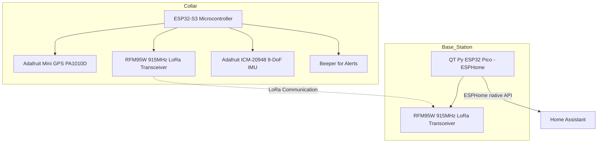
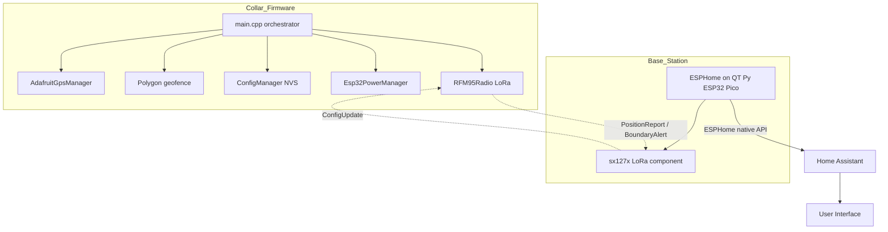

# Uncollar

An open-source GPS-tracking dog collar project designed for pet owners who want to monitor their dog's location, set boundaries, and receive alerts via a LoRa-connected base station integrated with Home Assistant.

## Repository Structure

This is a monorepo. Each system component has its own top-level directory:

| Directory | Contents | Status |
|---|---|---|
| [`collar/`](collar/) | ESP32-S3 collar firmware — GPS, geofence, LoRa TX, deep sleep | Active |
| [`basestation/`](basestation/) | ESP32 base station firmware — LoRa RX, WiFi, Home Assistant via ESPHome | Active |
| [`homeassistant/`](homeassistant/) | Home Assistant custom integration — device tracker, alerts, config UI | Planned |
| [`hardware/`](hardware/) | Bill of materials and component documentation | Active |
| [`docs/`](docs/) | Project-wide documentation (MkDocs) | Active |

## Description

Uncollar aims to provide a fully hackable, low-power GPS tracking solution for dogs. The system consists of a collar equipped with GPS, LoRa radio, and optional sensors, communicating with a base station that interfaces with Home Assistant for seamless user interaction. The project reuses the housing from an electric fence dog collar and incorporates commercial off-the-shelf (COTS) electronics to keep costs low and customization high.

Key objectives:
- Open-source and modifiable design
- Accurate GPS location tracking
- Configurable boundary alerts (beep/vibration/shock for the dog, notifications for the owner)
- Long-range communication via LoRa radio
- Home Assistant integration for remote monitoring and control
- Rechargeable, low-power operation

## Features

- **GPS Tracking**: Real-time location monitoring using GPS modules.
- **Boundary Alerts**: Define virtual fences; alerts triggered when the dog crosses boundaries.
- **LoRa Communication**: Reliable, long-range wireless communication between collar and base station.
- **Home Assistant Integration**: Seamless UI for monitoring and configuration via ESPHome native API.
- **Low Power Design**: Optimized for battery life with rechargeable components.
- **Open Source**: Fully hackable hardware and software under Apache 2.0 license.
- **Optional Sensors**: IMU for activity detection and orientation.

## Hardware

The project uses COTS components for ease of assembly and modification.

### Collar Components

- **Microcontroller**: Adafruit QT Py ESP32-S3 WiFi Dev Board
- **GPS Module**: Adafruit Mini GPS PA1010D (with antenna)
- **LoRa Radio**: RFM95W 915MHz transceiver
- **IMU (Optional)**: Adafruit TDK InvenSense ICM-20948 9-DoF IMU
- **Antenna**: Custom pigtail antenna
- **Alert Mechanism**: Beeper (for audible alerts)
- **Power**: Rechargeable battery (via Adafruit LiIon or LiPoly Charger BFF)

### Base Station Components

- **Microcontroller**: Adafruit QT Py ESP32 Pico
- **LoRa Radio**: RFM95W 915MHz transceiver
- **Antenna**: Custom pigtail antenna

For a complete hardware inventory, see [hardware/documentation/inventory.md](hardware/documentation/inventory.md).

### System Diagram


```mermaid
graph TD
    subgraph Collar
        A[ESP32-S3 Microcontroller]
        B[Adafruit Mini GPS PA1010D]
        C[RFM95W 915MHz LoRa Transceiver]
        D[Adafruit ICM-20948 9-DoF IMU]
        E[Beeper for Alerts]
        A --> B
        A --> C
        A --> D
        A --> E
    end
    subgraph Base_Station
        F[QT Py ESP32 Pico - ESPHome]
        G[RFM95W 915MHz LoRa Transceiver]
        F --> G
    end
    C -.->|LoRa Communication| G
    F -->|ESPHome native API| I[Home Assistant]
```

## Software

The system has three software components:

- **Collar Firmware** (`collar/`): C++ / Arduino / PlatformIO. Handles GPS acquisition, geofence checking, LoRa transmission, and deep-sleep power management.
- **Base Station Firmware** (`basestation/`): ESPHome on an Adafruit QT Py ESP32 Pico. Receives LoRa packets from the collar via the SX127x component and exposes position, boundary status, and signal strength as native Home Assistant entities over the ESPHome API.
- **Home Assistant Integration** (planned): MQTT-based real-time location display, configurable geofence, and boundary-crossing alerts.

### Collar Firmware Class Architecture

Each subsystem exposes a pure-virtual C++ interface so implementations are swappable and testable on native (no hardware required).

| Interface | Concrete class | Responsibility |
|---|---|---|
| `IConfigManager` | `ConfigManager` | Persist home position and geofence vertices to ESP32 NVS |
| `IGpsManager` | `AdafruitGpsManager` | Initialize GPS, acquire fix, convert NMEA → decimal degrees |
| `IPowerManager` | `Esp32PowerManager` | Disable WiFi/BT, enter deep sleep |
| `IRadio` | `RFM95Radio` *(stub)* | LoRa packet TX/RX (to be wired to a driver) |
| — | `Polygon` | Ray-casting point-in-polygon geofence test |

**LoRa wire protocol** (defined in `collar/lib/radio/radio.h`, pure C++, shared with base station):

| Message | Direction | Purpose |
|---|---|---|
| `PositionReport` | Collar → Base | Lat/lon, fix quality, inside/outside boundary, battery |
| `BoundaryAlert` | Collar → Base | Immediate notification on boundary crossing |
| `ConfigUpdate` | Base → Collar | Updated home position, geofence, and warn settings |
| `WarnEnable` | Base → Collar | Enable or disable outside-boundary warnings |

### Software Architecture Diagram


```mermaid
graph TD
    subgraph Collar_Firmware
        MAIN[main.cpp orchestrator]
        GPS[AdafruitGpsManager]
        GEO[Polygon geofence]
        CFG[ConfigManager NVS]
        PWR[Esp32PowerManager]
        RADIO[RFM95Radio LoRa]
        MAIN --> GPS
        MAIN --> GEO
        MAIN --> CFG
        MAIN --> PWR
        MAIN --> RADIO
    end
    subgraph Base_Station
        BS[ESPHome on QT Py ESP32 Pico]
        SX[sx127x LoRa component]
        BS --> SX
    end
    RADIO -.->|PositionReport / BoundaryAlert| SX
    SX -.->|ConfigUpdate| RADIO
    BS -->|ESPHome native API| HA[Home Assistant]
    HA --> UI[User Interface]
```

## Home Assistant Entities & Services

Once the base station is added to Home Assistant, the following entities are available:

### Sensors

| Entity | Description |
|---|---|
| Dog Latitude | Last reported latitude in decimal degrees |
| Dog Longitude | Last reported longitude in decimal degrees |
| Dog GPS Satellites | Number of satellites used for the last fix |
| Collar Battery | Battery voltage in mV (0 until a battery sensor is wired) |
| LoRa RSSI | Signal strength of the last received LoRa packet (dBm) |

### Binary Sensors

| Entity | Description |
|---|---|
| Dog Inside Boundary | `on` while the collar reports inside the geofence |
| Boundary Alert | `on` while the dog is outside the geofence (inverse of Dog Inside Boundary, useful for HA notifications) |

### Text Sensors

| Entity | Description |
|---|---|
| Config Update Status | `Queued` while a config packet is pending delivery; `Sent` after it is transmitted |

### Switches

| Entity | Description |
|---|---|
| Collar Boundary Warnings | Enables or disables the collar's audible/vibration warning when outside the boundary. Toggling queues a `WarnEnable` packet delivered to the collar on its next check-in. State is restored on basestation reboot. |

### Services

#### `esphome.uncollar_basestation_send_boundary_update`

Queues a full configuration update for delivery to the collar. The packet is transmitted the next time the collar sends a position report (within one wake cycle, typically ≤ 5 seconds).

| Parameter | Type | Description |
|---|---|---|
| `default_lat` | `float` | Home position latitude — used in position reports when no GPS fix is available |
| `default_lon` | `float` | Home position longitude |
| `boundary_lats` | `float[]` | Ordered list of geofence vertex latitudes (3–16 vertices) |
| `boundary_lons` | `float[]` | Ordered list of geofence vertex longitudes (must be the same length as `boundary_lats`) |
| `warn_after_seconds` | `int` | How long the collar must be continuously outside the boundary before the first warning fires |
| `repeat_warn_seconds` | `int` | How long between subsequent warnings while the dog remains outside |
| `warn_action` | `int` | Which actuator fires: `0` = beep, `1` = vibrate |

All parameters are persisted to NVS on the collar and restored after a power cycle.

---

## Configuration Reference

All collar configuration is stored in ESP32 NVS under the namespace `uncollar_cfg` and survives both deep sleep and full power cycles. Default values are written on the very first boot.

### Geofence & Home Position

| NVS Key | Type | Default | Description |
|---|---|---|---|
| `cfg_lat` | `float` | `40.72272` | Home position latitude (NYC Central Park — change for your location) |
| `cfg_lon` | `float` | `-74.02116` | Home position longitude |
| `cfg_bnd_cnt` | `uint8` | `4` | Number of boundary polygon vertices (3–16) |
| `cfg_bnd_N_lat` | `float` | See below | Latitude of vertex N |
| `cfg_bnd_N_lon` | `float` | See below | Longitude of vertex N |

The default boundary is a ~100 m × 100 m square centred on the default home position. Replace it with your actual yard polygon via `send_boundary_update`.

### Outside-Boundary Warnings

| NVS Key | Type | Default | Description |
|---|---|---|---|
| `cfg_warn_aft` | `uint16` | `30` | Seconds the collar must be continuously outside the boundary before the first warning fires |
| `cfg_warn_rep` | `uint16` | `30` | Seconds between subsequent warnings while still outside |
| `cfg_warn_act` | `uint8` | `0` (beep) | Actuator: `0` = beep, `1` = vibrate |
| `cfg_warn_on` | `bool` | `true` | Master enable for outside-boundary warnings |

`cfg_warn_aft` and `cfg_warn_rep` are set via `send_boundary_update`. `cfg_warn_on` is set via the **Collar Boundary Warnings** switch in HA.

### Firmware Compile-Time Constants

These are not user-configurable at runtime; change them in `collar/src/main.cpp` and reflash.

| Constant | Value | Description |
|---|---|---|
| `GPS_UPDATE_INTERVAL_US` | `5 000 000 µs` (5 s) | Deep-sleep duration between wake cycles |
| `GPS_FIX_TIMEOUT_MS` | `3 000 ms` | Maximum time to wait for a GPS fix per wake |
| `CONFIG_RECEIVE_TIMEOUT_MS` | `2 000 ms` | Receive window after each position report, long enough for a max-size `ConfigUpdate` at SF9/125 kHz |

---

## Boundary & Warning Behavior

### Geofence Definition

The boundary is a closed polygon defined by 3–16 GPS vertices in order (clockwise or counter-clockwise both work). The point-in-polygon test uses the ray-casting even-odd rule with a bounding-box pre-check for efficiency. The polygon does not close automatically — the last vertex connects back to the first.

Vertices are set via the `boundary_lats` / `boundary_lons` arrays in `send_boundary_update` and are stored in NVS so they survive power cycles.

### Position Determination

On every wake cycle the collar attempts to acquire a GPS fix (up to `GPS_FIX_TIMEOUT_MS` = 3 s). Three outcomes are possible:

1. **Fresh fix acquired** — position is used directly; `lastFix` RTC variable is updated.
2. **No fix, `lastFix` valid** — the most recent saved position is used; a note is logged but no warning is suppressed.
3. **No fix, no `lastFix`** — first boot only. The hardcoded `DEFAULT_LATITUDE` / `DEFAULT_LONGITUDE` is used, which reports as inside the default boundary. Replace defaults before deploying.

Because the last known position is used when the GPS cannot get a fix, brief signal loss (e.g., inside a building) will not immediately trigger a warning — the collar continues to report the last known location.

### Wake Cycle & Timing Quantization

The collar wakes every 5 seconds, runs its check, then sleeps again. All warning durations are therefore **quantized to 5-second multiples**: a `warn_after_seconds` value of 12 means the first warning fires at 15 s (the first wake cycle where `cyclesOutside × 5 ≥ 12`), not at exactly 12 s. The maximum overshoot is one sleep interval (4 s with the default 5 s interval).

### Outside-Boundary Streak

The collar maintains two counters in RTC memory that survive deep sleep:

- **`cyclesOutside`** — increments by 1 each wake cycle spent outside; resets to 0 the first cycle the collar is inside.
- **`cyclesSinceWarn`** — tracks cycles since the most recent warning fired (0 = no warning has fired yet in this streak); resets to 0 with `cyclesOutside`.

As soon as the collar finds itself inside the boundary all counters reset, the streak ends, and the next time it exits the boundary the full `warn_after_seconds` delay applies again.

### Warning Sequence

```
  ← warnAfterSeconds →← repeatWarnSeconds →← repeatWarnSeconds →
  ┌──┬──┬──┬──┬──┬──┬──┬──┬──┬──┬──┬──┬──┬──┬──┬──┬──┬──┐
  │  │  │  │  │  │  │W │  │  │  │  │  │W │  │  │  │  │  │W │  ...
  └──┴──┴──┴──┴──┴──┴──┴──┴──┴──┴──┴──┴──┴──┴──┴──┴──┴──┘
  Outside ──────────────────────────────────────────────────►
  W = warning fires (beep or vibrate)
  Each box = one 5 s wake cycle
```

1. The collar exits the boundary → `cyclesOutside` starts incrementing.
2. When `cyclesOutside × 5 ≥ warn_after_seconds` → **first warning fires**.
3. The repeat timer starts. When `cyclesSinceWarn × 5 ≥ repeat_warn_seconds` → **warning fires again**.
4. Step 3 repeats indefinitely until the collar returns inside.
5. On re-entry all counters reset.

Note: `cyclesSinceWarn` increments even when warnings are disabled. This means if you disable warnings while the dog is outside and then re-enable them, the repeat cadence resumes mid-streak rather than starting over.

### Warnings Enabled / Disabled

The **Collar Boundary Warnings** HA switch controls whether the actuator (beep or vibrate) fires. When disabled:

- Streak counters still advance normally.
- `warn_outside_boundary()` is not called — no beep or vibrate.
- The `Dog Inside Boundary` sensor and `Boundary Alert` sensor in HA are **not affected** — position reporting and geofence status continue regardless of this setting.
- The setting is delivered to the collar as a `WarnEnable` packet and persisted to NVS, so it survives power cycles.

The packet is queued exactly like a `ConfigUpdate` and delivered on the next PositionReport. The collar's receive window is 2 s; if the collar misses the packet (e.g., radio initialisation fails), the switch state in HA and the collar's NVS will be out of sync until the next successful delivery.

### Warn Action

Two actuators are supported:

| Value | Action | Notes |
|---|---|---|
| `0` (beep) | `beep()` | Default. GPIO implementation pending hardware installation. |
| `1` (vibrate) | `vibrate()` | GPIO implementation pending hardware installation. |

The actuator is selected by `warn_action` in `send_boundary_update` and stored in NVS.

## Installation (Nominal - To Be Completed)

### Prerequisites
- ESP32 development environment (Arduino IDE or ESP-IDF)
- Home Assistant instance
- MQTT broker (e.g., Mosquitto)

### Collar Setup
1. Assemble hardware components as per schematics.
2. Flash collar firmware to ESP32-S3.
3. Configure GPS and LoRa settings.
4. Test boundary alerts.

### Base Station Setup
1. Wire RFM95W to QT Py ESP32 Pico — see [basestation/WIRING.md](basestation/WIRING.md).
2. Copy `basestation/esphome/secrets.yaml.example` to `secrets.yaml` and fill in WiFi, OTA password, and LoRa sync word.
3. Install via ESPHome dashboard or CLI (`esphome upload basestation/esphome/basestation.yaml`).
4. Add to Home Assistant — entities appear automatically via ESPHome native API.

Detailed setup instructions will be added as development progresses.

## Usage (Nominal - To Be Completed)

1. Power on the collar and base station.
2. Use Home Assistant to define boundaries and monitor the dog's location.
3. Receive alerts on your device when the dog approaches or crosses boundaries.
4. Recharge the collar as needed.

Example Home Assistant configuration snippet:
```yaml
mqtt:
  sensor:
    - name: "Dog Location"
      state_topic: "uncollar/location"
      value_template: "{{ value_json.latitude }}, {{ value_json.longitude }}"
```

## Contributing (Nominal - To Be Completed)

Contributions are welcome! This project is open-source under the Apache 2.0 license.

- Fork the repository
- Create a feature branch
- Submit a pull request with detailed changes

For hardware contributions, please document any modifications in the inventory or schematics.

## License

This project is licensed under the Apache License 2.0. See [LICENSE](LICENSE) for details.
