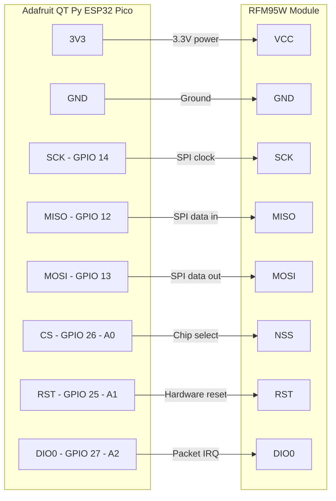

# Basestation Wiring — QT Py ESP32 Pico ↔ RFM95W

## SPI Connection (RFM95W LoRa Radio)

The RFM95W connects over the ESP32's HSPI (SPI2) hardware bus. All signals are 3.3 V logic.

| Signal       | ESP32 GPIO | QT Py label | RFM95W pin | Notes                          |
|--------------|:----------:|-------------|:----------:|--------------------------------|
| Power        | —          | 3V3         | VCC        | 3.3 V only — do not use 5 V   |
| Ground       | —          | GND         | GND        |                                |
| SPI clock    | 14         | SCK         | SCK        | HSPI bus                       |
| SPI data in  | 12         | MISO        | MISO       | HSPI bus                       |
| SPI data out | 13         | MOSI        | MOSI       | HSPI bus                       |
| Chip select  | 26         | A0          | NSS        | Active low, driven by ESPHome  |
| Hardware RST | 25         | A1          | RST        | Active low                     |
| Packet IRQ   | 27         | A2          | DIO0       | Packet done / RX ready         |

> **Note:** DIO1 is not connected. ESPHome's sx127x component uses interrupt-driven DIO0 for receive notification; DIO1 is not required.

## Diagram

