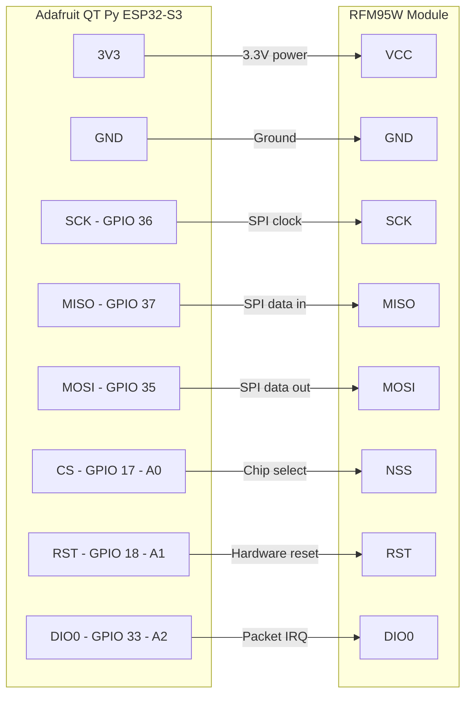

# Collar Wiring — QT Py ESP32-S3 ↔ RFM95W

## SPI Connection (RFM95W LoRa Radio)

The RFM95W connects over the ESP32-S3's FSPI hardware bus. All signals are 3.3 V logic.

| Signal       | ESP32-S3 GPIO | QT Py label | RFM95W pin | Notes                        |
|--------------|:-------------:|-------------|:----------:|------------------------------|
| Power        | —             | 3V3         | VCC        | 3.3 V only — do not use 5 V |
| Ground       | —             | GND         | GND        |                              |
| SPI clock    | 36            | SCK         | SCK        | FSPI bus                     |
| SPI data in  | 37            | MISO        | MISO       | FSPI bus                     |
| SPI data out | 35            | MOSI        | MOSI       | FSPI bus                     |
| Chip select  | 17            | A0          | NSS        | Active low, driven by RadioLib |
| Hardware RST | 18            | A1          | RST        | Active low                   |
| Packet IRQ   | 33            | A2          | DIO0       | Packet done / RX ready       |

> **Note:** DIO1 is not connected. The current firmware uses polling (`available()`)
> after `startReceive()`, so DIO1 is not required.

## Diagram

## I2C Bus (existing — for reference)

GPS (PA1010D) and LCD share `Wire1` and do not conflict with SPI.

| Device      | Bus   | SDA GPIO | SCL GPIO | I2C Address |
|-------------|-------|:--------:|:--------:|:-----------:|
| GPS PA1010D | Wire1 | 41       | 40       | 0x10        |
| LCD (16×2)  | Wire1 | 41       | 40       | 0x27        |
